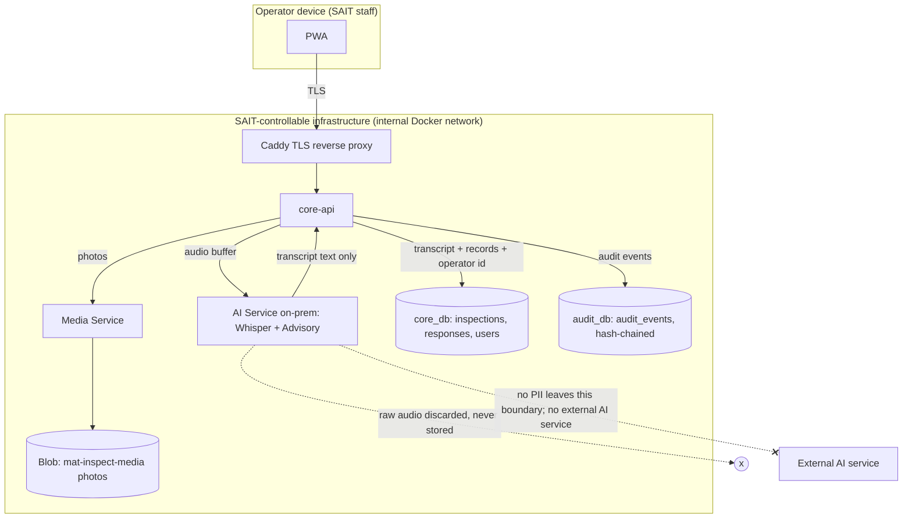

# FOIP and Privacy Data-Flow and Retention

This document describes the personal information MAT-Inspect collects, where each item flows,
where it is stored, how long it is kept, and who can read it. It exists because SAIT ITS (reply
2026-06-24) stated that ITS will not assess the privacy implications of MAT-Inspect during the
capstone, and named voice recordings and operator identification as personal information that
requires Security, Privacy, and Data Governance review before any production adoption (ADR 0016).
This document is written so that a future SAIT reviewer can pick up that assessment without the
capstone team.

Scope: the delivered capstone artifact, the Docker Compose stack defined in this repository. It
describes what the system does as built, and marks separately any capability that is designed and
present in the code but not wired into the running data path. Alberta FOIP is the governing privacy
regime. This document does not assert a FOIP compliance determination; that determination is ITS and
the sponsoring school's to make. It gives the reviewer the facts needed to make it.

---

## 1. Personal information inventory

| Data class         | Personal information                                       | Sensitivity                    |
| ------------------ | ---------------------------------------------------------- | ------------------------------ |
| Raw voice audio    | An operator's recorded voice, captured for a defect note   | Biometric PII under FOIP       |
| Transcript text    | The text of a spoken defect note, plus how it was produced | Operator-attributable content  |
| Operator identity  | Entra object id (`oid`), subject (`sub`), display name     | Directly identifying           |
| Inspection records | Who inspected what, when, with what result and attestation | Operator-attributable activity |
| Photos             | Defect photos an operator captures during an inspection    | May incidentally contain PII   |
| Audit events       | An append-only, hash-chained log of system actions         | Operator-attributable activity |

The system does not collect operator email, phone number, address, or any special-category data
beyond the voice sample described below. It stores no equipment-user data about anyone other than
the SAIT staff who operate the app.

---

## 2. Data-flow, storage, and retention

| Data class         | Captured                      | Transmitted                                                                          | Stored                                                     | Retention                                         |
| ------------------ | ----------------------------- | ------------------------------------------------------------------------------------ | ---------------------------------------------------------- | ------------------------------------------------- |
| Raw voice audio    | PWA, on the operator's device | To core-api `/ai/transcribe`, then to the on-prem AI Service on the internal network | Not stored (see 2.1)                                       | Not retained: discarded after transcription       |
| Transcript text    | Returned by the AI Service    | In the inspection submit payload                                                     | `inspection_responses` (core_db)                           | 7 years (immutable row)                           |
| Operator identity  | Entra login (MSAL)            | In the validated access token                                                        | `users` shadow row and `inspections.operator_id` (core_db) | 7 years (immutable inspection rows)               |
| Inspection records | PWA submit                    | To core-api over TLS                                                                 | `inspections`, `inspection_responses` (core_db)            | 7 years (immutable)                               |
| Photos             | PWA camera, on a failed item  | To the Media Service through core-api                                                | `mat-inspect-media` Blob container                         | Kept with the inspection (7-year evidence window) |
| Audit events       | Written by the Audit Service  | Internal network only                                                                | `audit_events` (audit_db)                                  | 7 years (append-only, hash-chained)               |

### 2.1 Raw voice audio is not stored

This is the most privacy-sensitive item, so it is stated precisely. In the delivered artifact, raw
voice audio is never written to storage. The PWA posts the audio to core-api `/ai/transcribe`. That
route checks the operator's token, then forwards the audio buffer to the on-prem AI Service and
returns the transcript. It performs no blob write and issues no upload token
(`services/core-api/src/routes/ai/transcribe.ts`). The transcript text and a `notes_source` marker
(`TYPED`, `VOICE_TRANSCRIBED`, or `VOICE_EDITED`) are the only artifacts persisted, in the
`inspection_responses` row. The raw audio exists only in memory during transcription and is
discarded when the request ends.

A 90-day retention-and-purge mechanism for raw voice audio is present in the code: a
`voice-retention` job (dev and dev-staging) and an equivalent Azure Storage lifecycle rule (a future
Azure deployment), both targeting a `mat-inspect-voice` Blob container, documented in
`docs/runbooks/voice-audio-retention.md`. This mechanism is built for a future owner who chooses to
persist voice clips. It is not wired into the current upload path: the upload path does not write to
that container (`services/media/src/lib/config.ts`), and the container does not exist until a first
voice upload that the delivered system never performs. A reviewer reading the code will see the
retention machinery; the accurate statement of current behavior is that no raw audio is stored, so
no raw-audio retention obligation is active in the delivered system. If a future owner enables voice
persistence, the 90-day purge described in that runbook becomes the governing control, and this
document must be updated to say so.

No voice clip, photo, or identifying inspection data is sent to any external AI service. Transcription
runs on the on-prem AI Service (faster-whisper), and the assistive Advisory Check runs an on-prem
model (ADR 0017, ADR 0018). Both stay on the internal Docker network and are reached only through
core-api (ADR 0019). The AI Service has no public route and no authentication of its own; core-api is
the only caller, and it checks the operator token before forwarding.

### 2.2 Operator identity

Identity comes from the SAIT staff member's Entra (Azure AD) login through MSAL. The validated access
token carries the object id (`oid`), subject (`sub`), and display name. core-api provisions a `users`
shadow row from the token on first use (JIT provisioning), and every inspection stores the operator's
id in `inspections.operator_id`. Alberta OHS s.257 and the Part 6 log-book rule require every
inspection to identify the competent human operator, so operator identity is a compliance requirement,
not an optional field (CLAUDE.md section 2). Structured logs record the operator's UUID only, never
the operator's name or token contents (CLAUDE.md section 4).

### 2.3 Photos

An operator captures a defect photo when an inspection item fails (photo-on-fail is enforced in the
PWA). Photos upload to the Media Service through core-api and are stored in the `mat-inspect-media`
Blob container. Each photo id is sealed into the inspection's content hash per response (ADR 0023),
so a photo cannot be swapped without breaking the audit chain. Photos are retained as inspection
evidence for the same 7-year window as the records they belong to. No separate photo purge job runs;
a future owner may add a photo lifecycle rule, but none is active now.

### 2.4 The 7-year window and immutability

Inspection, inspection-response, and audit rows are append-only. Database triggers reject UPDATE and
DELETE on `inspections`, `inspection_responses`, and `audit_events`, and a statement-level trigger
blocks TRUNCATE on the audit table (ADR 0007, ADR 0008). Records are therefore retained by not being
deletable, for the 7-year record-retention window the inspection program requires. A correction is a
new linked inspection row, never an edit to an old one. This immutability is the tamper-evidence the
OHS Part 6 record-keeping story depends on.

---

## 3. Storage location and control

All personal information stays on SAIT-controllable infrastructure. During the capstone the stack
runs on the team-operated mini-PC (Docker Compose), with PostgreSQL for `core_db` and `audit_db` and
Azurite as the local Blob emulator (ADR 0004, ADR 0005, ADR 0016). A future SAIT-hosted deployment
would use Azure Database for PostgreSQL and a real Azure Blob Storage account in a SAIT tenant, with
the same containers. In both shapes the data does not leave infrastructure the operator's institution
controls, and nothing identifying is sent to a third-party AI service.

Transport: operator devices reach the stack only through the Caddy reverse proxy over TLS; every other
service sits on the internal Docker network with no inbound port (ADR 0020). Service-to-service calls
stay on that internal network.

---

## 4. Access controls

Access is role-based. Roles come from Entra App Roles on the validated token, and every API endpoint
declares the roles it allows through a `requireRole` preHandler; an endpoint without a declared role
fails closed (CLAUDE.md section 4).

| Role       | Reads                                                                                      |
| ---------- | ------------------------------------------------------------------------------------------ |
| operator   | Their own inspection flow; equipment status they operate                                   |
| supervisor | Team inspection activity and the failure queue                                             |
| manager    | Fleet-wide inspection records and reports                                                  |
| admin      | Configuration (checklist templates); no special data-read privilege beyond a manager       |
| auditor    | Read-only access to inspection and audit records, restricted to read-only pages (ADR 0021) |

The `auditor` role is read-only by design. The `audit_writer` database role that the Audit Service
runs as holds INSERT and SELECT on `audit_events` only, with no UPDATE or DELETE grant, so even the
service that writes the audit log cannot alter it (ADR 0008).

---

## 5. For the reviewer

The prerequisites ITS named for a production privacy assessment are a Security, Privacy, and Data
Governance review under a named business owner (ADR 0016). This document supplies the data-flow and
retention facts that review needs. Two items depend on decisions the capstone team does not own and
should be revisited at adoption:

1. Whether a future owner enables raw voice-clip persistence. If yes, the 90-day retention control in
   `docs/runbooks/voice-audio-retention.md` becomes active and section 2.1 must be updated.
2. Whether the deployment moves to a SAIT Azure tenant. That changes the storage account and the
   Entra registration but not the data classes or the retention windows in this document.

Related documents in the governance package: source-code ownership and license (DEV-77), vulnerability
and change management (DEV-78), the security controls doc (`SECURITY.md`, DEV-44), and the governance
adoption brief that indexes them (DEV-79). ADR 0016 is the decision record that frames this package.
